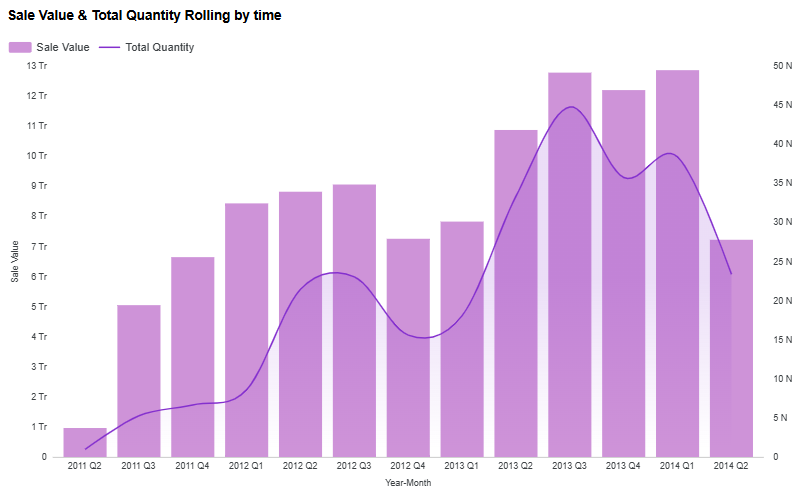

# Bicycle Sales & Inventory Analytics (SQL)

SQL analytics project analyzing bicycle sales performance, inventory efficiency, promotion costs, and customer retention using the AdventureWorks dataset.

---

## 📌 Project Overview
This project focuses on a bicycle manufacturing and retail business.  
Using SQL, the analysis answers key business questions related to sales growth, inventory management, promotions, and customer retention to support operational and strategic decision-making.

**Industry:** Bicycle Manufacturing & Retail  
**Dataset:** AdventureWorks sample database (BigQuery public dataset)  
**Time period:** 2011 – 2014  
**Tools:** Google BigQuery (Standard SQL)

---

## 🎯 Business Objectives
- Analyze bicycle sales performance by subcategory
- Identify fast-growing product segments
- Understand regional sales concentration
- Evaluate seasonal promotion costs
- Measure customer retention behavior
- Assess inventory efficiency and stock risk
- Monitor operational exposure from pending purchase orders

---

## 📊 Business Questions & Key Insights

### 1️⃣ Bicycle Sales Performance (Last 12 Months)
Sales and quantity consistently peak in Q3, indicating a clear seasonal demand pattern at the quarterly level. Revenue is highly concentrated in Road Bikes and Mountain Bikes, which together contribute the majority of total sales and largely drive overall performance.

Sales value and quantity show a strong positive relationship with high volatility.
Revenue growth appears to be driven by volume and large orders rather than clear seasonality.

Sales value is highly concentrated in Road Bikes and Mountain Bikes,
which together contribute more than 70% of total revenue.

📂 SQL: [01_sales_l12m.sql](sql/query_01_sales_l12m.sql)

---

### 2️⃣ Year-over-Year Growth by Subcategory
**Insight:**  
Apparel-related products (Socks, Shorts, Jerseys) show the strongest YoY growth, indicating expansion opportunities beyond core bicycle products.

📂 SQL: [02_yoy_growth.sql](sql/query_02_yoy_growth.sql)

---

### 3️⃣ Top Sales Territories by Order Quantity
**Insight:**  
A small number of territories consistently dominate bicycle demand, with TerritoryID 4 ranking #1 across multiple years.

📂 SQL: [03_top_territory.sql](sql/query_03_top_territory.sql)

---

### 4️⃣ Seasonal Promotion Discount Cost
**Insight:**  
Discount costs increased year-over-year, particularly for helmets, highlighting the need to balance promotional spend and margin protection.

📂 SQL: [04_discount_cost.sql](sql/query_04_discount_cost.sql)

---

### 5️⃣ Customer Retention Analysis (2014 Cohort)
**Insight:**  
Customer retention drops sharply after the first purchase month, emphasizing the importance of early post-purchase engagement.

📂 SQL: [05_customer_retention.sql](sql/query_05_customer_retention.sql)

---

### 6️⃣ Inventory Stock Trend & MoM Change
**Insight:**  
Inventory levels fluctuate significantly across products, suggesting demand forecasting and production planning challenges.

📂 SQL: [06_stock_trend.sql](sql/query_06_stock_trend.sql)

---

### 7️⃣ Stock-to-Sales Ratio Analysis
**Insight:**  
Several bicycle models show high stock-to-sales ratios, indicating overstocking and slow-moving inventory risks.

📂 SQL: [07_stock_sales_ratio.sql](sql/query_07_stock_sales_ratio.sql)

---

### 8️⃣ Pending Purchase Orders Risk
**Insight:**  
A large number of pending purchase orders represent material operational and financial risk for the supply chain.

📂 SQL: [08_pending_orders.sql](sql/query_08_pending_orders.sql)

---

## 🔑 Key Takeaways
- Bicycle sales are driven by a small number of high-performing products and regions.
- Accessories and apparel offer strong growth potential.
- Inventory management is a critical operational challenge.
- Promotions and procurement decisions have direct margin and cash-flow impact.
- Customer retention requires focused post-purchase strategies.

---

## 🚀 Next Steps
- Build dashboards for sales, inventory, and retention tracking
- Integrate demand forecasting and inventory optimization
- Extend analysis to profitability and customer lifetime value (CLV)
