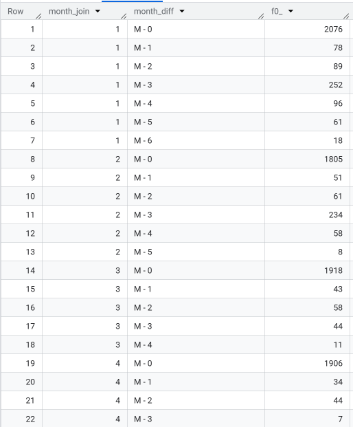
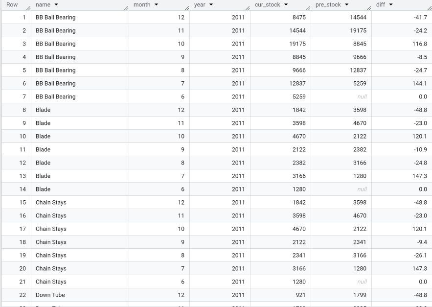
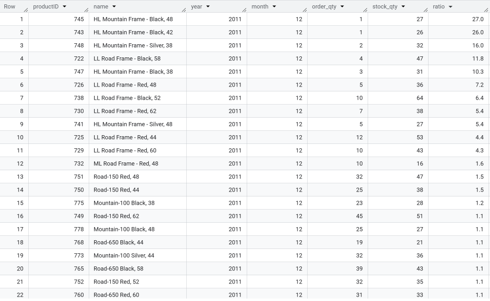

# Bicycle Sales & Inventory Analytics (SQL)

SQL analytics project analyzing bicycle sales performance, inventory efficiency, promotion costs, and customer retention using the AdventureWorks dataset.

---

## 📌 Project Overview
This project focuses on a bicycle manufacturing and retail business.  
Using SQL, the analysis answers key business questions related to sales growth, inventory management, promotions, and customer retention to support operational and strategic decision-making.

**Industry:** Bicycle Manufacturing & Retail  
**Dataset:** AdventureWorks sample database (BigQuery public dataset)  
**Time period:** 2011 – 2014  
**Tools:** Google BigQuery (Standard SQL)

---

## 🎯 Business Objectives
- Analyze bicycle sales performance by subcategory
- Identify fast-growing product segments
- Understand regional sales concentration
- Evaluate seasonal promotion costs
- Measure customer retention behavior
- Assess inventory efficiency and stock risk
- Monitor operational exposure from pending purchase orders

---

## 📊 Business Questions & Key Insights

### 1️⃣ Bicycle Sales Performance
<em>
Note: The analysis above focuses on the most recent 12 months. To better assess long-term trends and seasonality, the analysis was later extended to a broader time period.
</em>

Sales and quantity **peak in Q3**, confirming a clear **seasonal pattern**.  
**Road Bikes and Mountain Bikes** are the dominant subcategories, contributing **over 70% of total revenue** and driving overall performance.

Revenue growth during peak periods is driven by higher sales volume, reinforcing the strong seasonal demand observed in Q3.

Sales value is highly concentrated in Road Bikes and Mountain Bikes,
which together contribute more than 70% of total revenue.

📂 SQL: [01_sales_l12m.sql](sql/query_01_sales_l12m.sql)

---

### 2️⃣ Year-over-Year Growth by Subcategory
**Insight:**  
Apparel-related products (Socks, Shorts, Jerseys) show the strongest YoY growth, indicating expansion opportunities beyond core bicycle products.

**Top 3 Subcategories by YoY Quantity Growth**

| Subcategory | Qty (Current) | Qty (Previous) | YoY Growth |
|------------|---------------|----------------|------------|
| **Socks**   | 2,724         | 523            | **+4.21x** |
| Shorts     | 5,761         | 1,586          | +2.63x    |
| Jerseys    | 12,104        | 4,263          | +1.84x    |

📂 SQL: [02_yoy_growth.sql](sql/query_02_yoy_growth.sql)

---

### 3️⃣ Top Sales Territories by Order Quantity
**Insight:**  
A small number of territories consistently dominate bicycle demand, with TerritoryID 4 ranking #1 across multiple years.

📂 SQL: [03_top_territory.sql](sql/query_03_top_territory.sql)

---

### 4️⃣ Seasonal Promotion Discount Cost
**Insight:**  
Discount costs increased year-over-year, particularly for helmets, highlighting the need to balance promotional spend and margin protection.

**Seasonal Discount Cost by Subcategory**

| Year | Subcategory | Discount Cost |
|------|-------------|---------------|
| 2012 | Helmets     | 827.65        |
| 2013 | Helmets     | 1,606.04      |

📂 SQL: [04_discount_cost.sql](sql/query_04_discount_cost.sql)

---

### 5️⃣ Customer Retention Analysis (2014 Cohort)
**Insight:**  
Customer retention drops sharply after the first purchase month, emphasizing the importance of early post-purchase engagement.

📂 SQL: [05_customer_retention.sql](sql/query_05_customer_retention.sql)

---

### 6️⃣ Inventory Stock Trend & MoM Change
**Insight:**  
Inventory levels fluctuate significantly across products, suggesting demand forecasting and production planning challenges.

📂 SQL: [06_stock_trend.sql](sql/query_06_stock_trend.sql)

---

### 7️⃣ Stock-to-Sales Ratio Analysis
**Insight:**  
Several bicycle models show high stock-to-sales ratios, indicating overstocking and slow-moving inventory risks.

📂 SQL: [07_stock_sales_ratio.sql](sql/query_07_stock_sales_ratio.sql)

---

### 8️⃣ Pending Purchase Orders Risk
**Insight:**  
A large number of pending purchase orders represent material operational and financial risk for the supply chain.

**Pending Purchase Orders Summary (2014)**

| Year | Status | Order Count | Total Value |
|------|--------|-------------|-------------|
| 2014 | 1      | 224         | 3,873,579.01 |

📂 SQL: [08_pending_orders.sql](sql/query_08_pending_orders.sql)

---

## 🔑 Key Takeaways
- Sales exhibit a clear seasonal pattern, with Q3 consistently being the peak period for both revenue and quantity.
- Road Bikes and Mountain Bikes dominate revenue, contributing over 70% of total sales and driving overall performance.
- Apparel and accessories show the strongest YoY growth, indicating potential to diversify beyond core bicycle products.
- Sales demand is concentrated in a few key territories, with TerritoryID 4 consistently leading order volume.
- Inventory volatility, rising promotion costs, and pending purchase orders highlight key operational and supply chain risks.
---

## 🚀 Next Steps
- Build dashboards for sales, inventory, and retention tracking
- Integrate demand forecasting and inventory optimization
- Extend analysis to profitability and customer lifetime value (CLV)
